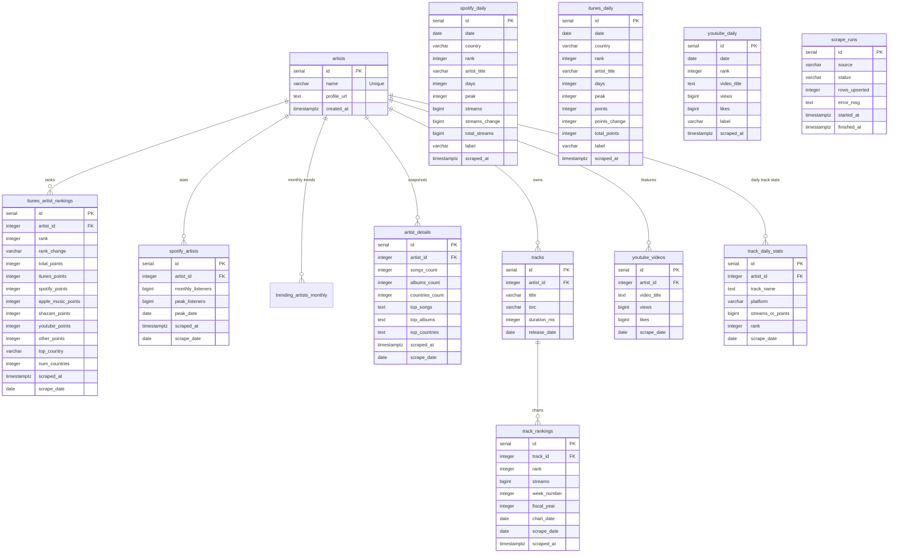

# Artist 360 Intelligence

A Python project to scrape music chart data from [kworb.net](https://kworb.net) and store it in PostgreSQL.

## Features
- Scrapes **iTunes Global Artist Rankings**
- Scrapes **Spotify Artists** (monthly listeners, peak data)
- Scrapes **Artist Details** (songs, albums, **Latin American countries** snapshot)
- Captures **Trending Artists for Last Month** (stored per calendar month)
- Tracks **Daily Chart Performance** (Spotify & iTunes daily/weekly charts per country, YouTube top videos)
- Monitors **Track Rankings** (weekly chart positions and streams via `track_rankings`)
- Manages **Labels & Discography** (Tracks, ISRC metadata, and label identification via AI)
- Stores all data in PostgreSQL with full audit trail (`scrape_runs` table)
- Daily scheduler built-in (runs at **10:55 UTC**)
- Includes an **AI Analyst chatbot** powered by **Anthropic Claude** in Streamlit that can query PostgreSQL and respond with narrative insights + charts

---

## Data Architecture & Schema

The project uses a relational PostgreSQL database schema. The `artists` table is the central hub, with performance data split across artist-level and track-level entities.

### Entity Relationship Diagram



### Table Definitions

#### 1. Core Entities
- **`artists`**: Registry of all tracked music artists.
- **`tracks`**: Centralized track registry including ISRC, duration, and metadata. Label information is stored directly in daily charts.

#### 2. Artist Performance
- **`itunes_artist_rankings`**: Daily global weighted rankings with platform-wise points (iTunes, Spotify, Apple Music, Shazam, YouTube).
- **`spotify_artists`**: Monthly listeners and peak audience metrics.
- **`trending_artists_monthly`**: Historical monthly leaderboards.
- **`artist_details`**: Comprehensive snapshots (songs, albums, top countries, and counts).
- **`youtube_videos`**: Video-level engagement metrics (views/likes) per artist.

#### 3. Daily Chart Tables
- **`spotify_daily`**: Daily Spotify chart entries per country (rank, streams, peak, streak days).
- **`itunes_daily`**: Daily iTunes chart entries per country (rank, points, peak, streak days).
- **`youtube_daily`**: Daily YouTube top video entries (rank, views, likes).

#### 4. Track Performance
- **`track_daily_stats`**: High-frequency performance data for specific tracks across platforms.
- **`track_rankings`**: Weekly chart rankings with streams, week numbers, and fiscal year metadata.

#### 5. System & Audit
- **`scrape_runs`**: Logs execution status, timing, error messages, and data volume for every scraping operation.

---

## Setup

### 1. Install dependencies
```bash
pip install -r requirements.txt
```

### 2. Configure environment
```bash
cp .env.example .env
# Edit .env with your PostgreSQL credentials
```

For the AI Analyst page in Streamlit, also set:

```bash
CLAUDE_API_KEY=your_anthropic_api_key_here
# Optional: override the default model
CLAUDE_MODEL=claude-opus-4-7
```

> **Note:** The chatbot uses **Anthropic Claude** (not OpenAI). Make sure to use `CLAUDE_API_KEY` in your `.env` or Streamlit secrets.

### 3. Run database migrations
```bash
python3 main.py migrate
```

---

## Usage

| Command | Description |
|---------|-------------|
| `python3 main.py scrape` | Run all scrapers |
| `python3 main.py scrape itunes` | iTunes global rankings only |
| `python3 main.py scrape spotify` | Spotify artist stats only |
| `python3 main.py scrape trending` | Trending artists (last month) only |
| `python3 main.py scrape details [limit]` | Artist detail snapshots from kworb profile pages |
| `python3 main.py scrape tracks` | Track rankings from kworb.net |
| `python3 main.py scrape daily` | Daily charts (Spotify global/US, iTunes ww/US, YouTube) |
| `python3 main.py schedule` | Run daily at **10:55 UTC** |
| `python3 main.py migrate` | Apply DB migrations |

---

## Dashboard

Run the Streamlit dashboard:
```bash
python3 -m streamlit run streamlit_app.py
```

Then open the **AI Analyst** page from the sidebar to ask data questions. The assistant (powered by **Anthropic Claude**) will:
- Detect artists or intent from your question
- Generate a safe `SELECT` SQL query against your PostgreSQL tables
- Execute the query and return tabular results
- Generate text insights with a narrative summary
- Render charts automatically when suitable data is returned (80% visual / 20% text output priority)

### AI Analyst Architecture
The chatbot follows an **MCP-aligned pipeline**:
1. **Plan** — Claude generates a JSON query plan (SQL + chart config) based on the schema
2. **Query** — Executes the safe, validated SQL against PostgreSQL
3. **Visualize** — Renders multi-chart views when the data supports it
4. **Narrate** — Produces a concise business insight summary

### Allowed Tables (AI Query Scope)
The AI agent is restricted to querying only these tables:
`artists`, `itunes_artist_rankings`, `spotify_artists`, `trending_artists_monthly`, `artist_details`, `tracks`, `track_rankings`, `scrape_runs`

---

## Migrations

| File | Description |
|------|-------------|
| `001_create_tables.sql` | Core tables: `artists`, `itunes_artist_rankings`, `spotify_artists`, `trending_artists_monthly`, `scrape_runs` |
| `002_create_artist_details.sql` | `artist_details` table |
| `003_add_daily_tables.sql` | Daily chart tables: `spotify_daily`, `itunes_daily`, `youtube_daily` |
| `004_create_track_rankings.sql` | `track_rankings` table with weekly chart data |
