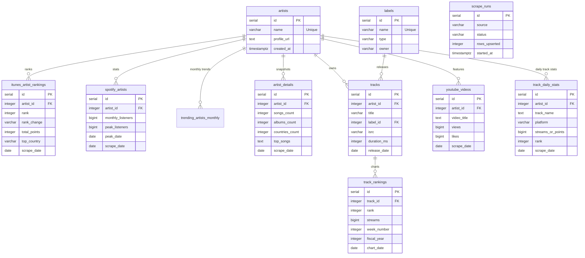

# Artist 360 Intelligence

A Python project to scrape music chart data from [kworb.net](https://kworb.net) and store it in PostgreSQL.

## Features
- Scrapes **iTunes Global Artist Rankings** (top 300)
- Scrapes **Spotify Artists** (monthly listeners, peak data)
- Scrapes **Artist Details** from kworb profile pages (songs, albums, **Latin American countries** snapshot)
- Captures **Trending Artists for Last Month** (stored per calendar month)
- Tracks **Detailed Track Metrics** (Spotify/Apple Music daily streams and rankings)
- Monitors **YouTube Performance** (views and likes per video)
- Manages **Labels & Discography** (Labels, Tracks, and ISRC metadata)
- Stores all data in PostgreSQL with full audit trail (`scrape_runs` table)
- Daily scheduler built-in
- Includes an **AI Analyst chatbot** in Streamlit that can query PostgreSQL and respond with narrative insights + charts

---

## Data Architecture & Schema

The project uses a relational PostgreSQL database schema. The `artists` table is the central hub, with performance data split across artist-level and track-level entities.

### Entity Relationship Diagram



### Table Definitions

#### 1. Core Entities
- **`artists`**: Registry of all tracked music artists.
- **`labels`**: Metadata for record labels (Name, Type, Parent Owner).
- **`tracks`**: Centralized track registry including ISRC, duration, and label associations.

#### 2. Artist Performance
- **`itunes_artist_rankings`**: Daily global weighted rankings (cross-platform points).
- **`spotify_artists`**: Monthly listeners and peak audience metrics.
- **`trending_artists_monthly`**: Historical monthly leaderboards.
- **`artist_details`**: Comprehensive snapshots (songs, albums, and geographical reach).
- **`youtube_videos`**: Video-level engagement metrics (views/likes) per artist.

#### 3. Track Performance
- **`track_daily_stats`**: High-frequency performance data for specific tracks across platforms (Spotify, Apple Music, etc.).
- **`track_rankings`**: Weekly or period-based chart rankings (streams, week numbers, fiscal year).

#### 4. System & Audit
- **`scrape_runs`**: Logs execution status, timing, and data volume for every scraping operation.

---

## Setup

### 1. Install dependencies
```bash
pip install -r requirements.txt
```

### 2. Configure environment
```bash
cp .env.example .env
# Edit .env with your PostgreSQL credentials
```

For the AI Analyst page in Streamlit, also set:

```bash
OPENAI_API_KEY=your_api_key_here
# Optional
OPENAI_MODEL=gpt-4o-mini
```

### 3. Run database migrations
```bash
python main.py migrate
```

---

## Usage

| Command | Description |
|---------|-------------|
| `python3 main.py scrape` | Run all scrapers |
| `python3 main.py scrape itunes` | iTunes global rankings only |
| `python3 main.py scrape spotify` | Spotify artist stats only |
| `python3 main.py scrape trending` | Trending artists (last month) only |
| `python3 main.py scrape details [limit]` | Artist detail snapshots from kworb profile pages |
| `python3 main.py schedule` | Run daily at 06:00 UTC |
| `python3 main.py migrate` | Apply DB migrations |

---

## Dashboard

Run the Streamlit dashboard:
```bash
python3 -m streamlit run streamlit_app.py
```

Then open the **AI Analyst** page from the sidebar to ask data questions. The assistant will:
- Generate a safe `SELECT` SQL query against your PostgreSQL tables
- Execute the query and return tabular results
- Generate text insights
- Render a chart automatically when suitable data is returned
